# MIUpdater

Im Rahmen der Semesterarbeit an der iBW wurde hier eine Applikation mit GUI entwickelt, welche es erlaubt, zu unterschiedlichen Servern
eine SSH Verbindung aufzubauen. Kunden / Server können in einer Datenbank erfasst werden, die Applikation lädt diese dann aus der Datebank. 
Weiter können über das GUI neue Kunden / Server hinzugefügt werden. Nicht mehr benötigte Server können über das GUI gelöscht werden.
Es ist eine Suchfunktion eingebaut, die es erlaubt nach Kunden zu suchen und die gewünschten Server auszüwählen. 
Bei der Ausführung des Programms werden die IP Adressen der ausgewählten Server ausgelesen und eine SSH Verbindung wird aufgebaut.

###Still to do:
- Implementierung des Time Button (entspricht Anforderung aus optionaler User Story Nummer 11)
- Verbindungsaufbau über SSH (entspricht Anforderung aus optionaler User Story Nummer 12)
- Überprüfung dass mindestens ein Server ausgewählt wurde bevor "Run" gestartet wird
- Fix von Remove Server: Beim Entfernen des letzten Server wird SuccessBox nicht angezeigt

## Systemvoraussetzung

Damit das Programm korrekt ausgeführt werden kann, müssen folgende Prerequisites erfüllt werden:

- Auf localhost muss PostgreSQL Server installiert sein und laufen (<a href="https://www.postgresql.org/download/">PostgreSQL Downloads</a>)

- Es wird der Standardport von PostgreSQL verwendet, 5432

- Der Benutzer für den Verbindungsaufbau ist postgres mit dem Standardpasswort postgres

- Anlegen der Datenbank MIUpdater

- Ausführung des CREATE.sql Files zur Initialisierung der benötigten Tables

- Optional: Ausführung des INSERT.sql Files zum Erfassen einiger Testdaten 

Anmerkung: Wenn man einen anderen Host / Benutzer / Port verwenden möchte, kann man die Angaben in der Klasse "DBCredentials" anpassen. Dies wurde im Rahmen der Entwicklung __NICHT__ getestet! 
Anpassung der Variablen url, user, pass 
Diese werden für den Verbindungsaufbau zur Datenbank benötigt.

## Installation

Falls nicht vorhanden, muss die PostgreSQL Library noch hinzugefügt werden, damit das Programm korrekt die Verbindung zur Datenbank
aufbauen kann.  Die Library kann hier heruntergeladen werden: <a href="https://jdbc.postgresql.org/download.html"> Download Driver </a> 
Während der Entwicklung wurde mit JDBC42 Version 9.4.1212 getestet.

Sind die Prerequisites alle erfüllt und die Library vorhanden, kann das Programm gestartet werden.

## Datenbank

Die verwendete Datenbank besteht aus 2 Tables, customer und server. Ein Screenshot des Datenbank Schema:  
 
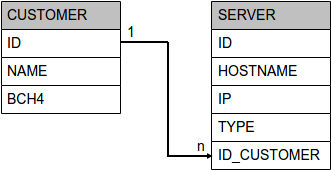
 
###customer

Der customer table besteht aus einer ID als Primary Key, dem Name Field (NOT NULL) als VARCHAR Field und dem BCH4 Field. 
BCH4 ist eine Abkürzung die einen Kunden eindeutig identifiziert. In diesem Feld können maximal 4 Zeichen erfasst werden.  
Es ist ebenfalls eine NOT NULL Bedingung vorhanden.
Zusätzlich sind beide Felder als UNIQUE definiert.

###server

Der server table bestehet ebenfalls aus einer ID als Primary Key. Weiter gibt es das hostname Field (NOT NULL) mit Type VARCHAR. Das IP Field ist als VARCHAR(15) Field definiert und hat auch eine NOT NULL Bedingung. 
Sowohl das hostname als auch das IP Field haben eine UNIQUE Bedigung. 
Das type Field legt den Servertyp fest, definiert als VARCHAR und ebenfalls NOT NULL. 
Das ID_Customer Field wird als Foreign Key verwendet und referenziert das ID Field vom customer table.
 
 

# Klassen

In diesem Abschnitt werden kurz die jeweiligen Klassen mit den wichtigsten Methoden vorgestellt.
Auszüge aus den erwähnten Methoden werden als Code Beispiele eingefügt.
 
## models/Customer

Die Klasse Customer hat eine name und bch4 Variable (private String).  
Dazugehörige setter und getter die benötigt werden, um die Werte zu definieren und auszulesen.  

Die wichtigste Methode ist die addCustomerToDB(Customer customer). Diese baut eine Verbindung zur Datenbank auf und führt ein Prepared Statement aus. In diesem Prepared Statement werden die Werte für name und bch4 übergeben und in die Datenbank geschrieben:

### Methode addCustomerToDB(Customer customer)

    public void addCustomerToDB(Customer customer) throws SQLException{
        Connection connAddCustomer = DriverManager.getConnection(DBCredentials.getUrl(), DBCredentials.getUser(), DBCredentials.getPass());

        PreparedStatement prepStateAddCustomer =
                connAddCustomer.prepareStatement("INSERT INTO customer(name, bch4) VALUES (?, ?)");
        prepStateAddCustomer.setString(1, customer.getName());
        prepStateAddCustomer.setString(2, customer.getBch4());

        prepStateAddCustomer.executeUpdate();

        prepStateAddCustomer.close();
        connAddCustomer.close();
    }
 
## models/CustomerResult

In dieser Klasse werden alle benötigten Daten aus der Datenbank geladen und in ein Array gespeichert. Dieses wird benötigt um für die Suchabfrage ein JTable zu erstellen, so dass nicht bei jeder Abfrage eine Verbindung zur Datenbank aufgebaut werden muss.

    public String[] loadCustomerResultToArray(CustomerResult customerResult) {
        String[] result = new String[4];
        result[0] = customerResult.getName();
        result[1] = customerResult.getHostname();
        result[2] = customerResult.getIp();
        result[3] = customerResult.getType();
        return result;
    }
 
## models/Server

In der models/Server Klassen sind 4 private String Variablen und eine private int Variable vorhanden. 
Diese werden für die Werte hostname, IP, type und name_customer sowie id benötigt. Es sind wieder dazugehörige getter / setter vorhanden.

In dieser Klasse gibt es zwei Prepared Statements. Eines um Server zur Datenbank hinzuzufügen, eines um Server aus der Datenbank zu löschen.

### Methode addServertoDB(Server server)
    public void addServerToDB(Server server) throws SQLException {

        Connection connAddServer = DriverManager.getConnection(DBCredentials.getUrl(), DBCredentials.getUser(), DBCredentials.getPass());        //Verbindung zur lokalen Datenbank

        Statement stategetNames = connAddServer.createStatement();
        ResultSet resultSetgetID = stategetNames.executeQuery("SELECT id FROM customer WHERE name = '" + getName_customer() + "'");         // Auslesen der ID des im Dropdown Feld ausgewählten Kunden

        /**
         * Aufbereitung des Resultset mit der ID des ausgewählten Kunden
         */
        while(resultSetgetID.next()) {
            int id = resultSetgetID.getInt(1);
            this.id = id;
        }

        /**
         * Vorbereitung Prepared Statement um Server hinzuzufügen.
         */
        PreparedStatement prepStateAddServer=
                connAddServer.prepareStatement("INSERT INTO server(hostname, ip, type, id_customer) VALUES (?, ?, ?, ?)");      //prepared Statement um neue Werte zum server table hinzuzufügen
        prepStateAddServer.setString(1, server.getHostname());      //get Hostname Value
        prepStateAddServer.setString(2, server.getIP());            //get Server IP Value
        prepStateAddServer.setString(3, server.getType());          //get Server Type Value
        prepStateAddServer.setInt(4, id);                           //get ID from selected Customer

        prepStateAddServer.executeUpdate();   //Ausführung des prepared Statement

        stategetNames.close();          //close Statement getNames
        prepStateAddServer.close();     //close prepared Statement AddServer
        connAddServer.close();          //close Connection to the Database
    }

### Methode removeServerfromDB(Server removeServer)
    public void removeServerfromDB(Server removeServer) throws SQLException {

        Connection connrmServer = DriverManager.getConnection(DBCredentials.getUrl(), DBCredentials.getUser(), DBCredentials.getPass());     //Verbindung zur lokalen Datenbank
        PreparedStatement prepStatermServer =
                connrmServer.prepareStatement("DELETE FROM server WHERE hostname = ?");     //prepared Statement um einen Server aus der Datenbank zu löschen
        prepStatermServer.setString(1, removeServer.getHostname());   //get Hostname of chosen Server

        prepStatermServer.executeUpdate();      //Ausführung des prepared Statement

        prepStatermServer.close();      //close prepared Statement rmServer
        connrmServer.close();       //close Connection to the Database
    }
 
## Controller

Im Controller werden die actionPerformed (Klicks auf Buttons) abgefangen.
Exemplarisch werden hier zwei Actions aufgezeigt:

### Action equals "Add Server"

    else if(e.getActionCommand().equals("Add Server")) {
            try {
                view.addServerBox();
            }catch(SQLException ex) {
                view.showErrorBox(ex.getMessage());
                LOG.severe(ex.getMessage());
            }
        }

Hier wird die addServerBox generiert, in welcher man die Daten für einen Server erfassen kann. 
Für alle Frames gibt es im __Abschnitt "Usage" jeweils einen Screenshot__

### Action equals "Add New Server"

    else if (e.getActionCommand().equals("Add New Server")) {

                Server server = new Server();
                server.setHostname(view.getAddServerHostnameTextField().getText());
                server.setIP(view.getAddServerIPTextField().getText());
                server.setType(view.getServerTypeField());
                server.setName_customer(view.getValueCustomerField().toString());
                if(view.getValueCustomerField() == "nocustomerselected") {          //Überprüfung ob "fikitver Wert "nocustomerselected" übergeben wird
                    view.showErrorBox("Please select a customer!");
                }
                else if(view.getAddServerHostnameTextField().getText().isEmpty()) {
                    view.showErrorBox("Hostname Field is empty!");
                }
                else if(view.getAddServerIPTextField().getText().isEmpty()){
                    view.showErrorBox("IP Field is empty!");
                }
                else {
                    try {
                        Class.forName("org.postgresql.Driver");
                        server.addServerToDB(server);
                        view.showSuccessBox(server);
                        LOG.info("Server zur DB hinzugefuegt");
                    } catch (ClassNotFoundException | SQLException ex) {
                        view.showErrorBox(ex.getMessage());
                        LOG.severe(ex.getMessage());
                    }
                }
            }
 
Hier wird ein neuer Server zur Datenbank hinzugefügt. 
Man sieht den Aufruf der addServerToDB Methode aus der Server Klasse. 
Ebenfalls wird überprüft, ob alle Felder ausgefüllt wurden. Falls nicht, wird eine Error Box generiert.
 
## Main

In der Main Methode wird das Frame für das Programm generiert. 
 
## Model

Im Model werden die Daten vorbereitet, die für das GUI benötigt werden.

Als Beispiel eine SQL Abfrage um alle Kunden Namen auszulesen:

### Methode loadNames()

    private void loadNames() throws SQLException {

        Connection conngetNames = DriverManager.getConnection(DBCredentials.getUrl(), DBCredentials.getUser(), DBCredentials.getPass()); //Connection to the local Database

        Statement stategetNames = conngetNames.createStatement();
        ResultSet resultSetgetNames = stategetNames.executeQuery("SELECT name FROM Customer");
        ResultSetMetaData NamesMD = resultSetgetNames.getMetaData();
        int columns = NamesMD.getColumnCount();

        ArrayList<String> names = new ArrayList<>(columns);

        while(resultSetgetNames.next()) {
            int i = 1;
            while(i <= columns) {
                names.add(resultSetgetNames.getString(i++));
            }
            this.names = names;
        }
        resultSetgetNames.close();
        stategetNames.close();
        conngetNames.close();
        LOG.info("Namen aus DB geladen");
    }

Diese Daten werden für ein Dropdown Field benötigt. Im Model sind weitere Abfragen definiert, unter anderem:
- findCustomers
- loadTypes
- loadServer
- load Customers

## View

In der Klasse View werden alle Elemente des GUI definiert. 
Als Beispiel: der Code für eine Success Box beim hinzufügen eines Kunden.  

### showSuccessBox(Customer customer)

        public void showSuccessBox(Customer customer) {
        JOptionPane optionPane = new JOptionPane();
        String message = "Customer: " + customer.getName() +
                " mit BCH4: " + customer.getBch4() + " hinzugefügt";
        JOptionPane.showMessageDialog(optionPane, message, "Success", JOptionPane.INFORMATION_MESSAGE);
        addCustomerNameTextField.setText("");
        addCustomerBch4TextField.setText("");
    }
 
## Logger

Es wurde ein Logger implementiert, der folgende Log Files generiert:
- controllerLogfile.txt
- modelLogfile.txt
- viewLogfile.txt

Der Log Level ist mit ALL definiert. Der Logger wird jeweils in der dazugehörigen Klasse initialisert.

### Beispiel logger für Controller
    private static Logger LOG = Logger.getLogger(Controller.class.getName());
    
    private static void initLogger(String filename) throws IOException {
        boolean append = true;
        Handler handler = new FileHandler(filename, append);
        handler.setFormatter(new SimpleFormatter());
        LOG.setLevel(loglevel);
        LOG.addHandler(handler);
    }

Der Logger zeichnet die erfolgreiche Ausführung und Exceptions auf.

###Auszug aus controllerLogfile.txt:
Jan 28, 2017 7:51:57 PM Controller actionPerformed
SCHWERWIEGEND: ERROR: value too long for type character varying(4)
Jan 28, 2017 7:51:59 PM Controller actionPerformed
INFORMATION: Kunde zur DB hinzugefuegt 
Jan 28, 2017 7:52:10 PM Controller actionPerformed
INFORMATION: Server zur DB hinzugefuegt
 
 
# Usage

In diesem Abschnitt wird gezeigt, wie man das Programm verwenden kann. Es werden mehrheitlich Screenshots dazu verwendet.
Die Beschriftung der Buttons und Felder sollte soweit selbsterklärend sein.

## Tests
Im Rahmen der zeitlichen Möglichkeiten sind folgende Tests entstanden:
- CustomerTests
- ServerTests
- ModelTests

Die Customer und Server Tests testen die Datenbankfunktionen der Klassen. 
Bei den Danebanktests werden fiktive Kunden und Server hinzugefügt oder gelöscht. 
Nach der Ausführung der Tests wird die Datenbank wieder in den Ursprungszustand gesetzt. 

Bei den ModelTests wird das Model gestestet, je nach Funktion. 
z.B. Namen laden, Namen finden 
So wird die Integrität der Logik sichergestellt.

### Test
    public void testLoadNamesNotNull() {
        try {
            assertNotNull(modelNull.getNames());
        } catch (SQLException e) {
            e.printStackTrace();
        }
    }

## Start

Der Start Screen des Programms:

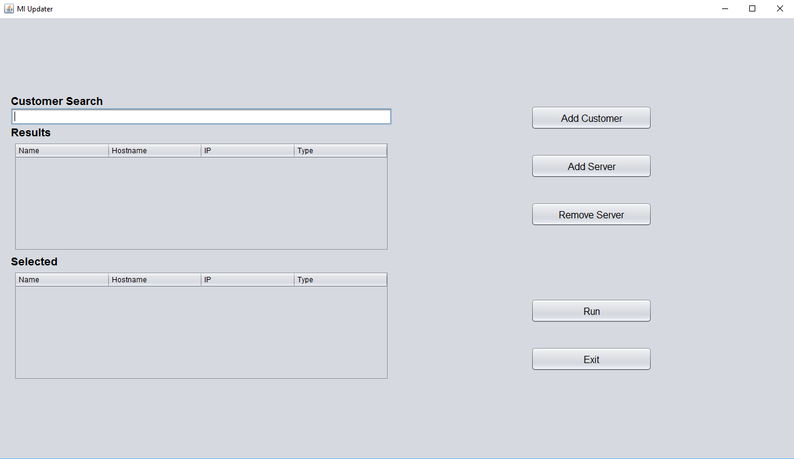
 
## Add Customer

Fenster um einen neuen Kunden hinzuzfügen. Erfassung des Namen und 4BCH Code:

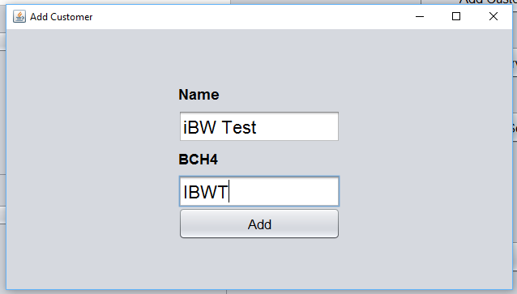
 
 
Anzeige beim Auftreten eines Fehlers beim Hinzufügen eines neuen Kunden:

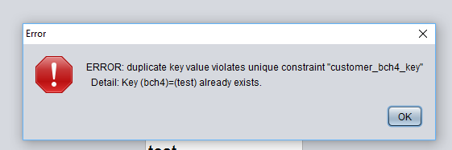
 
 
Anzeige beim erfolgreichen Hinzufügen eines Kunden:
 
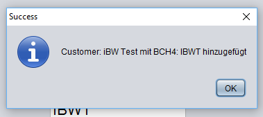
 
## Add Server

Fenster um einen neuen Server hinzuzufügen. Erfassen des Hostname, IP und Type. Auswahl des Kunden von Dropdown Menu:

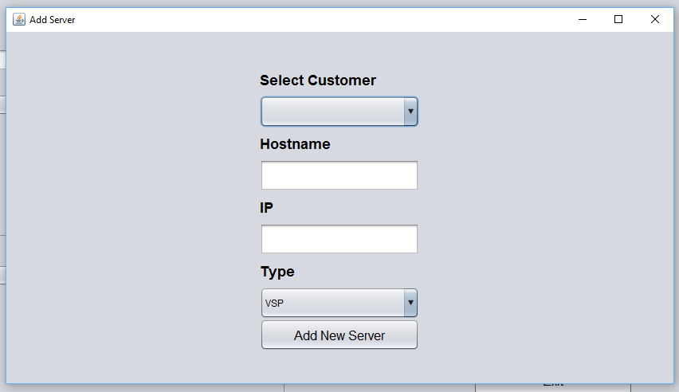
 
 
Anzeige beim Auftreten eines Fehlers beim Hinzufügen eines neuen Server:

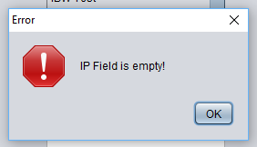
 
 
Anzeige beim erfolgreichen Hinzufügen eines Server:

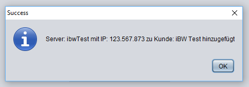
 
## Remove Server

Fenster um einen bestehenden Server aus der Datenbank zu löschen. Auswahl über 2 Dropdown Menüs:

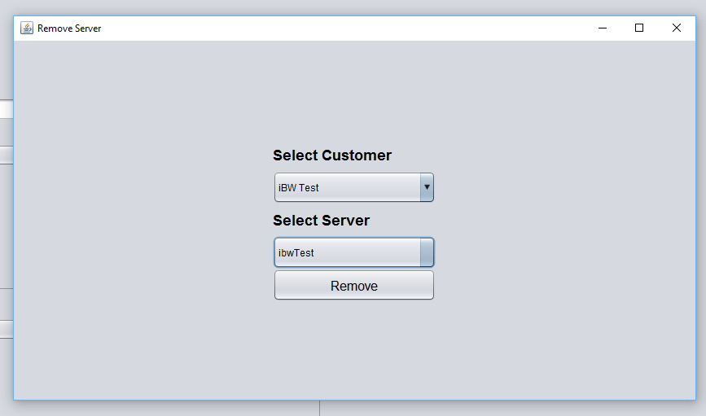
 
 
Anzeige falls ausgewählter Kunde keine Server hat:

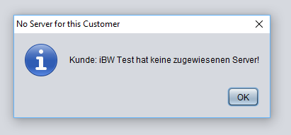
 
 
Anzeige beimerfolgreichen Löschen eines Servers:
 
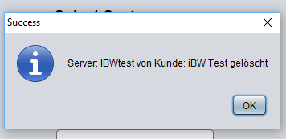
 
## Select and Running

Auswahl der Server nach Eingabe im Suchfeld. Einmal anklicken und Server wird zu "Selected" hinnzugefügt:

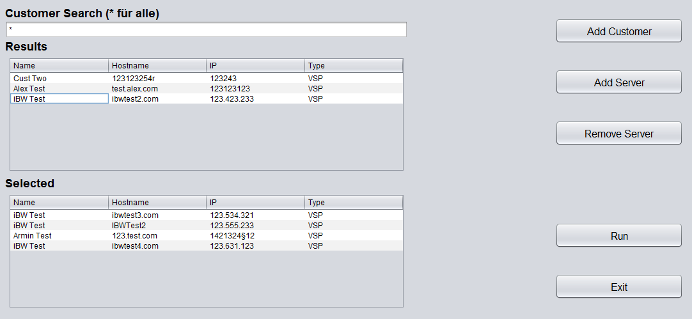
 
 
Anzeige sobald Button "Run" angeklickt wird:

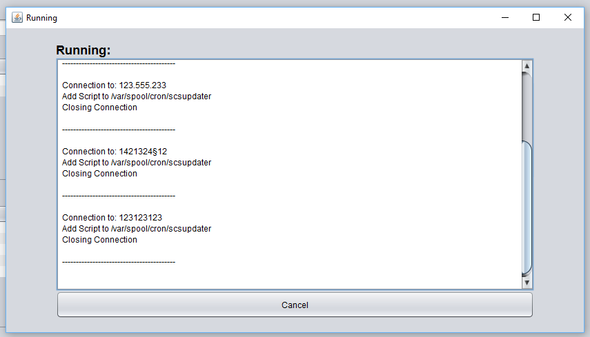
 

# Meta
###Autoren 
Alex Zaeper - a.zaeper@gmx.de 
Armin Beiner - armin.beiner@hotmail.com

###Info 
Entwickelt im Rahmen der Semesterarbeit an der <a href ="http://www.ibw.ch/home/">iBW Chur</a> 
für den Studiengang <a href="http://www.ibw.ch/kurs/angebot/detail/ndk_hf_grundlagen_software_entwicklung_161102a_2018/">NDK HF Grundlagen Software-Entwicklung</a> 
 
https://github.com/beerbardude/MIUpdater
